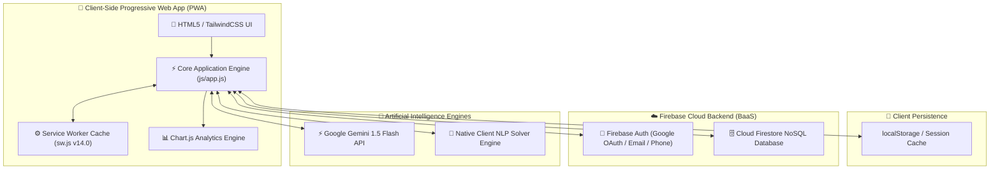
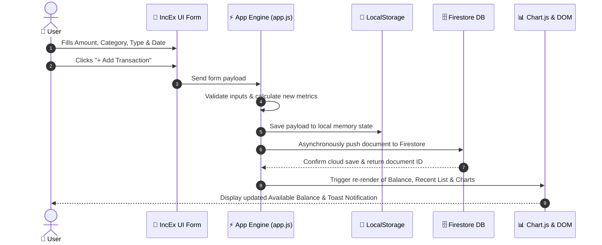
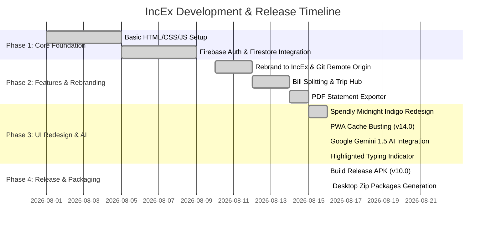

# 📊 IncEx Project Charts & Architecture (6 Variations)

This document presents **6 distinct visual and structural project chart variations** for the **IncEx (Income, Expense & Wealth Tracker)** PWA application.

---

## 1. System Architecture Flowchart

Visualizes the end-to-end data and execution flow from the client browser UI down to local PWA caches, Firebase Cloud services, and external AI models.

---

## 2. Technology Stack & Language Matrix

A comprehensive breakdown of all layers, technologies, languages, and purposes in the project.

| Layer | Language / Library | Technology | Key Purpose & Function |
| :--- | :--- | :--- | :--- |
| **Frontend UI** | HTML5, CSS3 | Tailwind CSS, Lucide Icons | Responsive Midnight Indigo dark layout, dynamic cards, modals, and navigation |
| **App Logic** | JavaScript (ES6+) | Vanilla JS ES Modules | State management, transaction CRUD, metric math, UI reactive updates |
| **Analytics & Data Vis** | JavaScript | Chart.js | Interactive trend charts, expense breakdown pie charts, monthly comparison |
| **Authentication** | JavaScript, JSON | Firebase Auth SDK | Google 1-Tap OAuth, Email/Password sign-in, Phone OTP verification |
| **Cloud Database** | JavaScript, JSON | Cloud Firestore NoSQL | Real-time multi-device cloud sync for transactions, splits, and trip logs |
| **Offline PWA** | JavaScript | Service Worker API | Network-first caching strategy (`v14.0`), offline installation, PWA manifest |
| **AI Advisor** | REST / JSON | Google Gemini 1.5 Flash API | Live real-time AI financial advice, SIP calculation, stock insights |
| **PDF Reporting** | JavaScript, HTML5 | html2pdf.js / Window Print | Client-side generation of branded PDF financial statements |
| **Mobile Packaging** | ZIP / Android WebApp | IncEx Release APK (`v10.0`) | Standalone Android APK container for mobile installation |

---

## 3. Financial Data Flow & Transaction Sequence

Illustrates the step-by-step sequence when a user logs a new transaction or expense.

---

## 4. Component Breakdown Structure (CBS)

Hierarchical breakdown of the core application modules and feature sets.

```mermaid
graph TD
    ROOT["📱 IncEx App Core"]

    ROOT --> AUTH["🔐 Auth & Profile Module"]
    AUTH --> A1["Google OAuth 2.0"]
    AUTH --> A2["Email / Password"]
    AUTH --> A3["Phone SMS OTP"]

    ROOT --> TX["💰 Transaction Manager"]
    TX --> T1["Income Logger"]
    TX --> T2["Expense Logger"]
    TX --> T3["Investment Tracker"]
    TX --> T4["Quick 1-Tap Chips"]

    ROOT --> DASH["📊 Analytics Dashboard"]
    DASH --> D1["Available Balance Display"]
    DASH --> D2["Income vs Expense Trend"]
    DASH --> D3["Category Pie Breakdown"]
    DASH --> D4["Empty State Containers"]

    ROOT --> AI_MOD["🤖 AI Advisor Hub"]
    AI_MOD --> AI1["Google Gemini 1.5 Flash API"]
    AI_MOD --> AI2["Native NLP Fallback Engine"]
    AI_MOD --> AI3["Highlight Typing Indicator"]

    ROOT --> SOCIAL["👥 Multi-User Hub"]
    SOCIAL --> S1["Bill Splitting Calculator"]
    SOCIAL --> S2["Group Trip Expense Logs"]
    SOCIAL --> S3["Group Live Chat"]

    ROOT --> REPORT["📄 Export & PWA System"]
    REPORT --> R1["PDF Statement Generator"]
    REPORT --> R2["Service Worker Cache v14.0"]
    REPORT --> R3["Android Release APK Package"]
```

---

## 5. Module Capability & Feature Matrix

Detailed technical specification matrix comparing storage modes, offline capabilities, and cloud sync.

| Module | Purpose | Storage Mode | Offline Support | Cloud Sync | Key Highlights |
| :--- | :--- | :--- | :--- | :--- | :--- |
| **Home Dashboard** | High-level metrics & recent activity | LocalStorage + Firestore | ✅ 100% Offline | ✅ Real-time | Prominent balance display, summary cards |
| **Transaction Logger** | Add income, expense, and investment | Local State + Firestore | ✅ 100% Offline | ✅ Real-time | Quick chips (`⛽ Fuel`, `🍔 Food`, `🛍️ Shop`) |
| **Analytics Hub** | Interactive visual charts | Client Canvas (Chart.js) | ✅ 100% Offline | N/A | Dynamic empty states when 0 data exists |
| **AI Advisor** | Personal financial guidance | API / Client Local Engine | ✅ Local Fallback | 🌐 Internet Needed | Google Gemini 1.5 Flash + Native NLP |
| **Bill Splitter** | Split expenses among friends | Local State + Firestore | ✅ 100% Offline | ✅ Real-time | Equal & custom percentage splits |
| **Trip Expense Hub** | Group trip tracking & chat | Firestore Shared Collections | 🌐 Network Preferred | ✅ Real-time | Live shared expense logs & group chat |
| **PDF Exporter** | Monthly financial statement export | Client-side DOM Render | ✅ 100% Offline | N/A | Suggested title `IncEx_Report_YYYY-MM-DD.pdf` |

---

## 6. Development Timeline & Release Roadmap

Gantt chart illustrating the project development phases, redesign, and final deployment.

